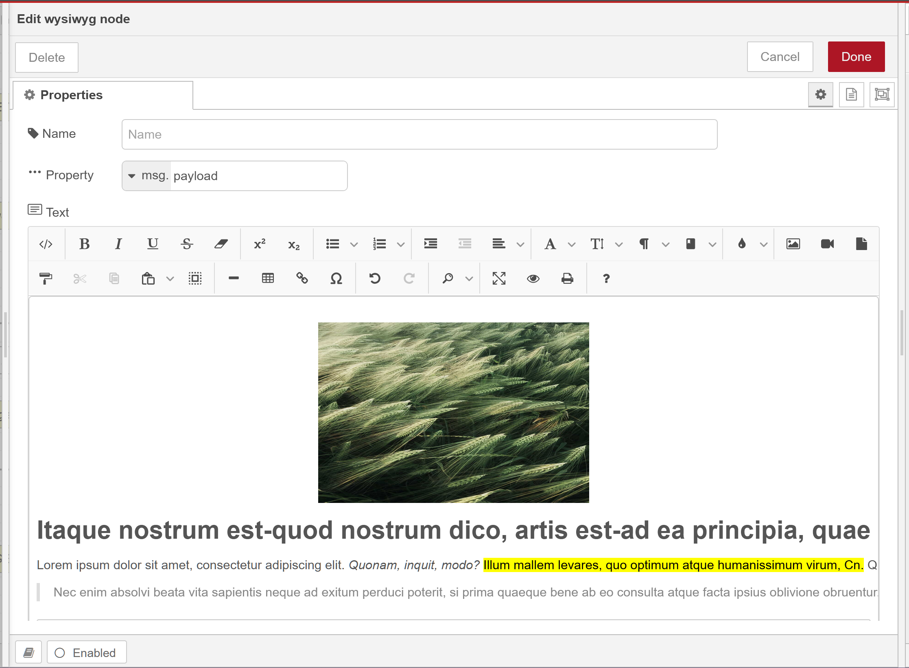

# Node-RED WYSIWYG Editor

[](https://flows.nodered.org/node/node-red-contrib-wysiwyg)

A WYSIWYG (What You See Is What You Get) editor node for Node-RED.

## Overview

This node allows you to create and edit rich text content directly within your Node-RED flows. It's particularly useful for creating:

- Email templates
- HTML content
- Formatted reports
- Documentation
- Any scenario requiring rich text editing



## Features

- **Rich Text Editor**: Full-featured WYSIWYG editor with formatting options
- **Flexible Output**: Store content in msg, flow, or global context
- **Email Ready**: Perfect for creating HTML email templates
- **Easy Integration**: Works seamlessly with Node-RED's email nodes
- **Customizable**: Set custom field names for better flow organization

## Installation

Run the following command in your Node-RED user directory (typically `~/.node-red`):

```bash
npm install node-red-contrib-wysiwyg
```

After installation, restart Node-RED to make the node available in your palette.

## Usage

1. Drag the WYSIWYG node from the palette to your flow
2. Double-click the node to open its configuration
3. Enter a name for the node (optional but recommended)
4. Configure the output settings:
   - **Field**: The property name to output to (default: 'payload')
   - **Field Type**: Where to store the output (msg, flow, or global context)
5. Click "Done" to save the configuration
6. Connect the node to other nodes in your flow as needed

## Email Template Example

Here's how to use this node to create an email template:

1. Add a WYSIWYG node to your flow
2. Double-click to open the editor
3. Create your email template with formatting, images, and links
4. Set the output field to `html` (or your preferred property name)
5. Connect it to an email node (like `node-red-node-email`)
6. In your email node, use `msg.html` as the email body

Example Flow:

```
[ WYSIWYG (Email Template) ] --> [ Email Node ]
```

### Using Template Variables

You can include dynamic content using handlebars syntax in your templates:

```html
<h1>Hello {{msg.name}}!</h1>
<p>Your order #{{msg.orderId}} has been shipped.</p>
```

These placeholders will be replaced with actual values from the message when the flow runs.

## Configuration

### Node Properties

- **Name**: A friendly name for the node (appears under the node in the flow)
- **Text**: The rich text content to output
- **Field**: The property name to output to (default: 'payload')
- **Field Type**: Where to store the output:
  - `msg`: Output to message object (default)
  - `flow`: Store in flow context
  - `global`: Store in global context

## Example

A simple flow that uses the WYSIWYG node to set a welcome message:

```
[ WYSIWYG ] --> [ Debug ]
```

## Contributing

Contributions are welcome! Please feel free to submit a Pull Request.

## License

[SEE LICENSE IN LICENSE.md](LICENSE.md)
